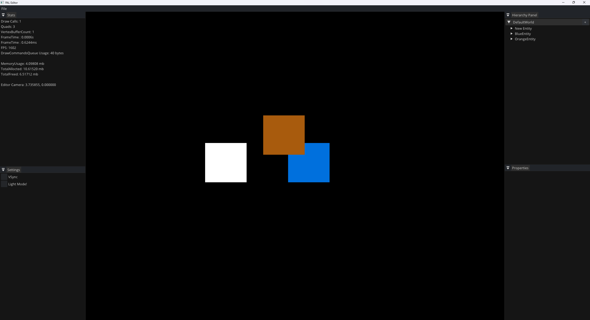

# PL-Engine

A 2D game engine with a Vulkan renderer and an ImGui-based editor, written in C++ to learn
graphics programming and engine architecture from the ground up.

Every line written by hand. No AI-generated code. The goal was to learn, not
to ship it.

Developed November 2023 - November 2024. Currently paused - see [Status](#status).



---

## What It Does

The engine renders batched, colored 2D quads through Vulkan and hosts them in an editor
where entities can be selected and inspected at runtime.

**Rendering**
- Vulkan backend: instance/device setup, swapchain, render passes, graphics pipeline,
  descriptor sets, command buffer recording
- Quad batch renderer with per-frame-in-flight vertex buffers
- Render command queue between the application and the backend
- Vulkan Memory Allocator (VMA) for buffer and image allocation
- Orthographic camera

**Editor**
- ImGui docking layout with the scene rendered to a viewport texture
- Entity hierarchy panel
- Mouse picking via a dedicated object-ID color attachment
- Runtime stats: frame time, draw calls, vertex buffer count

**Core**
- Entity Component System built on [entt](https://github.com/skypjack/entt)
  (Transform, Render, Layer, Tag components)
- Event and input system
- Frame profiler ([Optick](https://github.com/bombomby/optick)) with scoped instrumentation
- Allocation tracker for leak detection
- Logging via [spdlog](https://github.com/gabime/spdlog), assertion macros that compile out
  in release builds
- Windowing and platform layer over GLFW, with an abstract entry point so a runtime or
  editor target can share the same engine

---

## Not Implemented

Listed so the scope is clear. None of these exist in the codebase:

- Textures and materials - geometry is vertex-colored only
- 3D rendering
- Scene serialization and asset management
- Physics
- Scripting
- Audio
- Linux/macOS support - Windows only
- Automated tests

---

## Building

Requires Windows, Visual Studio 2022 or newer, and Vulkan SDK 1.3.204.1.

```
git clone https://github.com/baselsaad/PL-Engine.git
cd PL-Engine/script
Build.bat
```

This generates `PL-Engine.sln` via premake. Open it and build the `Editor` target.

Shaders in `Source/Engine/res/shaders` are GLSL and must be compiled to SPIR-V with `glslc`
before running - the engine loads `.spv` files directly and does not compile at runtime.

---

## Credits and Influences

The engine follows [Hazel](https://github.com/TheCherno/Hazel) by
[The Cherno](https://www.youtube.com/@TheCherno), whose Game Engine series I worked through
while building this. 

*Game Engine Architecture* by Jason Gregory shaped the higher-level design decisions, the
subsystem layering, the engine/editor/runtime split, and the resource and memory management
model.

Third-party libraries: Vulkan, GLFW, ImGui, entt, glm, spdlog, VulkanMemoryAllocator,
Optick, stb_image.

---

## Status

Paused since November 2024, for time rather than technical reasons

---

## License

See [LICENSE](LICENSE).
